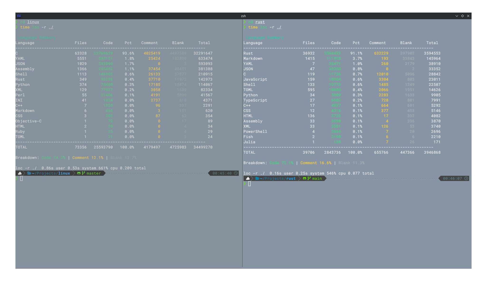
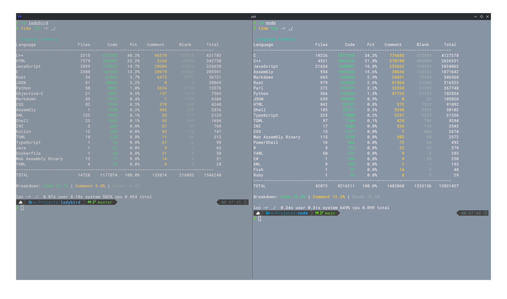

# mini-loc

`mini-loc` is an ultra-fast, minimal tool designed to index codebases. It is built for raw performance in C, making it an ideal choice for quickly scanning large project directories to count lines of code, comments, and blank lines.

## Performance

Built with speed in mind, `mini-loc` handles massive codebases in sub-second times.
(Ran on an i7-1156G7; 24 GBs of ram; On an m.2 NVME)

| Target           | Single-Threaded | Multi-Threaded |
| :--------------- | :-------------- | :------------- |
| **Linux Kernel** | ~1.1s           | ---            |
| **Node.js**      | ~0.5s           | ---            |
| **Ladybird**     | ~0.1s           | ---            |
| **Rust**         | ~0.3s           | ---            |
| **Vscode**       | ~0.5s           | ---            |
| **Pi-hole**      | ~0.01s          | ---            |

### Multi-Threaded Performance





### Single-Threaded Performance


## Building

This project uses a `Makefile` for building and managing the project. Ensure you have `gcc`, `make`, `clang-format`, and `clang-tidy` installed.

### Build the project

To compile both versions of the source code, run:

```bash
make all
```

Or build a specific version:

```bash
make single
# or
make multi
```

The resulting binaries will be located in the `bin/` directory.

### Cleaning

To remove all build artifacts and the binaries, run:

```bash
make clean
```

### Installation

You can install `mini-loc` to your `~/.local/bin` directory. You will be prompted to choose between the single-threaded and multi-threaded versions:

```bash
make install
```

Alternatively, you can install a specific version directly:

```bash
make install-single
# or
make install-multi
```

To uninstall:

```bash
make uninstall
```

## Usage

Point the program at a directory to begin indexing:

```bash
loc -r /path/to/codebase
```

Help for the loc program:

```bash
❯ loc --help
Usage: mini-loc [options]

Counts lines of code, comments, and blanks.

Options:
  --recurse        -r    Recurse into directories
  --files          -f    Show per-file results
  --lang-file      -l    Language definition file
  --append         -a    Append language definitions
  --list-unknown         List unknown files
  --verbose              Show file extensions
  --filter               Filter output: code, comment, or blank
  --help           -h    Display this help
  --completions          Print shell completions (bash/zsh)
```

## License

This project is open-source and licensed under the [MIT License](LICENSE).
