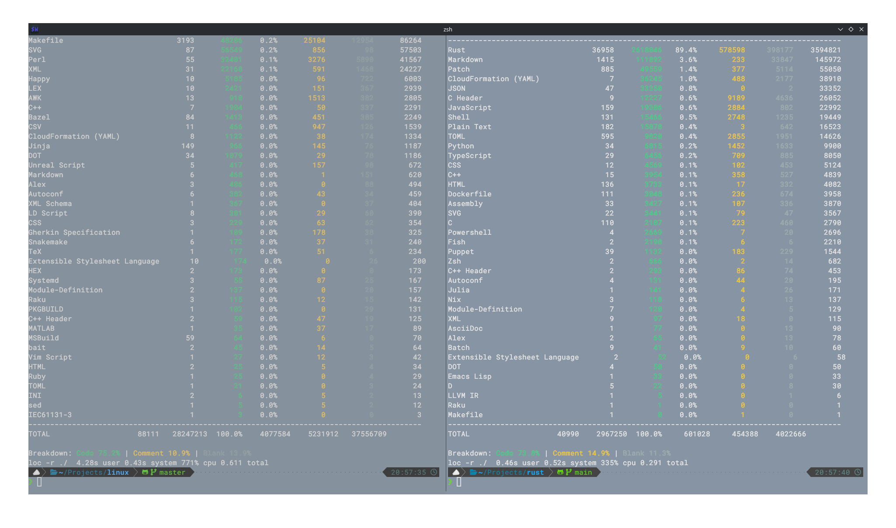
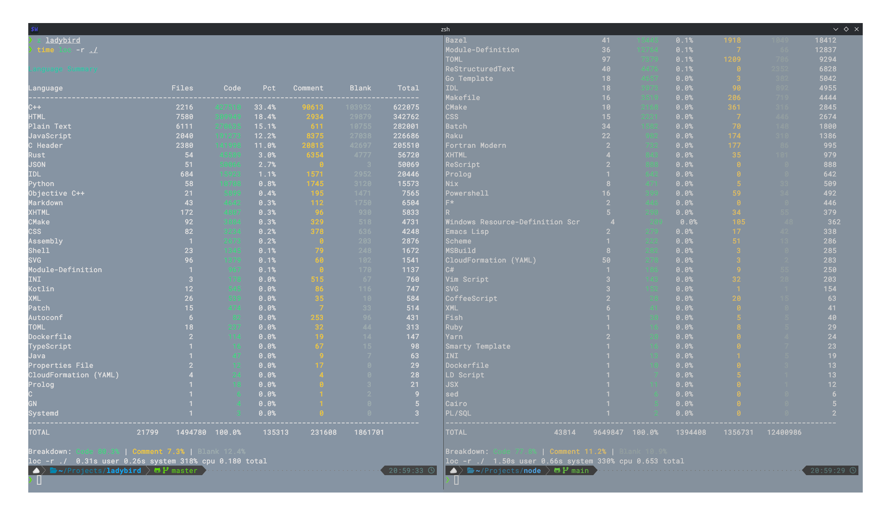
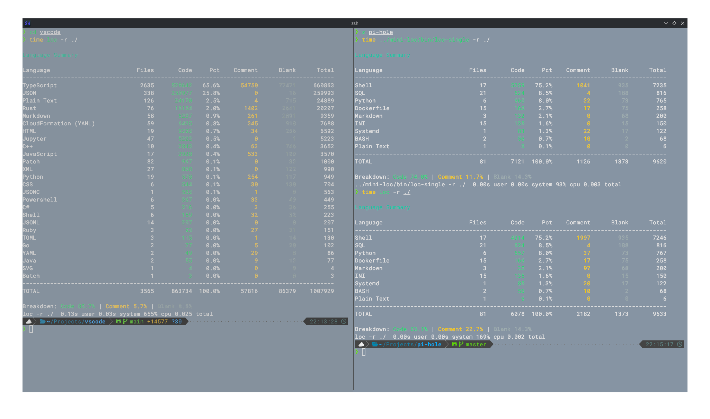
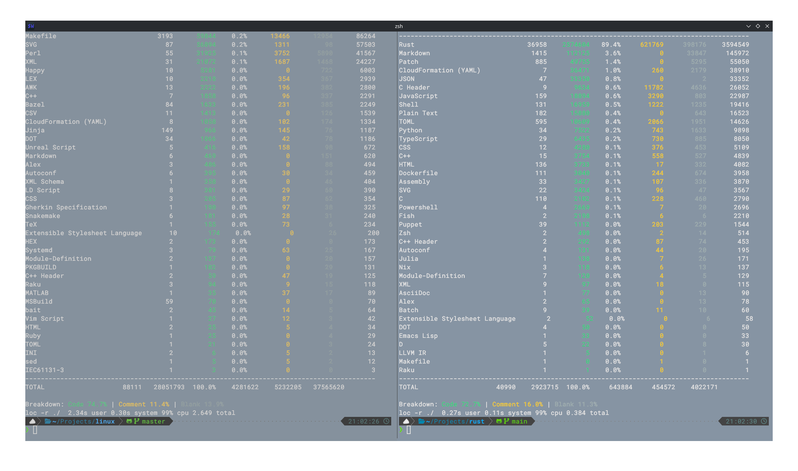
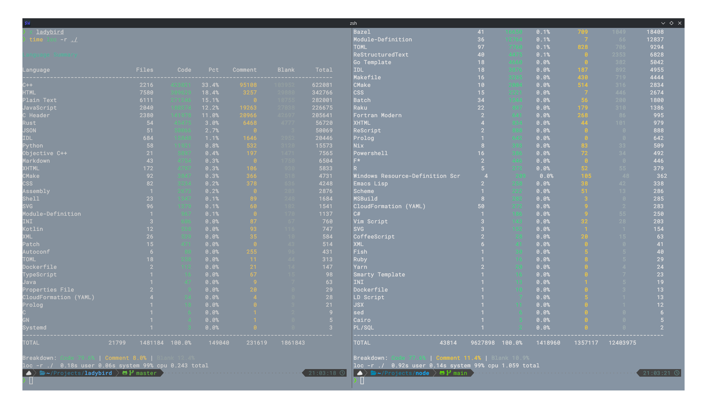
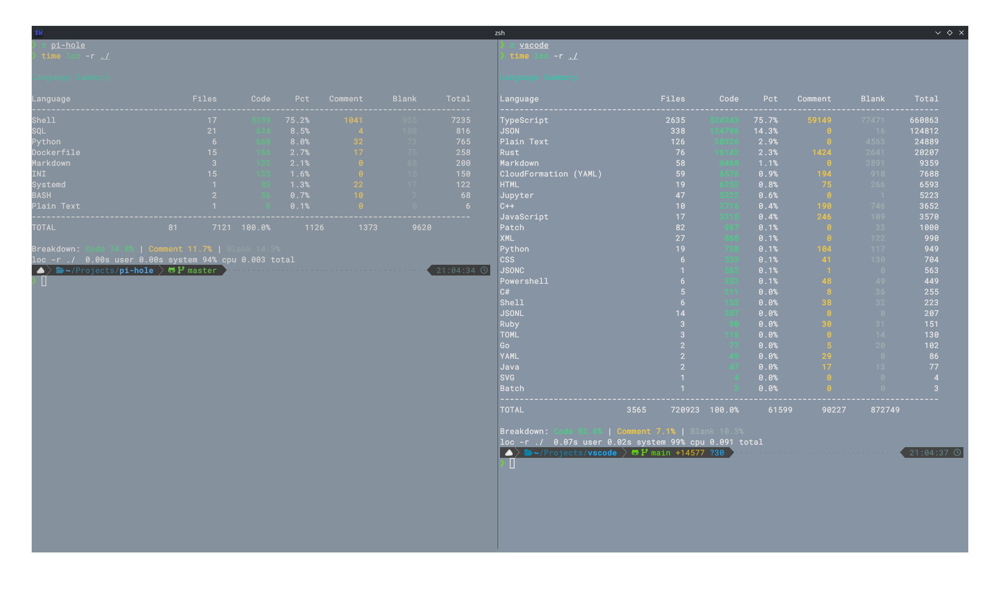

# mini-loc

`mini-loc` is an ultra-fast, minimal tool designed to index codebases. It is built for raw performance in C, making it an ideal choice for quickly scanning large project directories to count lines of code, comments, and blank lines.

## Code and Speed Attribution

A big thank you to [Ben Boyter](https://github.com/boyter/scc/), and his write up on the speed improvements of his tool [SCC](https://github.com/boyter/scc/) (It is far more stable and ci ready than mine will ever be). And for allowing me to make use of his far more encompassing and better done [languages.json](https://github.com/boyter/scc/blob/master/languages.json) in the use of this project. Furthermore he even pointed out flaws in my file reading, which lead to inaccurate readings and where i should focus for speed gains.

## Performance

Built with speed in mind, `mini-loc` handles massive codebases in sub-second times.


There are the make targets for `pgo-gen`, `copy-optimized`, and make `optimized`. To make profiled optimized builds.
`copy-optimized` is to ensure the .gitignore doesnt drop the `.gcda` profiles for the 3 targets.

The way i implemented multi threading means that for smaller directories the gap
is minimal, in the case of the Vscode git clone the difference was about 0.06
seconds, with pihole i am willing to bet they are either the exact same or has a minimal difference.
While the gap with the linux kernel is nearly a factor of 4.

For most i am willing to bet that single-threaded will be good enough, but when indexing a large repo or a large number of repos i would say go for the multi-threaded approach.

(Ran on an i7-1156G7; 24 GBs of ram; On an m.2 NVME)

| Target           | Single-Threaded | Multi-Threaded | Scc            |
| :--------------- | :-------------- | :------------- | :------------- | 
| **Linux Kernel** | ~2.7s           | ~0.65s         | ~2.0s          |
| **Node.js**      | ~1.1s           | ~0.7s          | ~0.95s         |
| **Ladybird**     | ~0.25s          | ~0.18s         | ~0.2s          |
| **Rust**         | ~0.4s           | ~0.3s          | ~0.4s          |
| **Vscode**       | ~0.09s          | ~0.03s         | ~0.07s         |
| **Pi-hole**      | ~0.003s         | ~0.002s        | ~0.004s        |

### Multi-Threaded Performance





### Single-Threaded Performance





## Building

This project uses a `Makefile` for building and managing the project. Ensure you have `gcc`, `make`, `clang-format`, and `clang-tidy` installed.

### Dependancies

cJson to be installed and used with the `gcc` linker flags.

### Platforms

To the best of my knowledge this project is not system or platform dependant.

There is code in the `Makefile` to detect when you are on macos to ensure the
needed `DARWIN` flag is added to gcc.

### Build the project

To compile both versions of the source code, run:

```bash
make all
```

Or build a specific version:

```bash
make single
# or
make multi
```

The resulting binaries will be located in the `bin/` directory.

### Cleaning

To remove all build artifacts and the binaries, run:

```bash
make clean
```

### Installation

You can install `mini-loc` to your `~/.local/bin` directory. You will be prompted to choose between the single-threaded and multi-threaded versions:

```bash
make install
```

Alternatively, you can install a specific version directly:

```bash
make install-single
# or
make install-multi
```

To uninstall:

```bash
make uninstall
```

## Usage

Point the program at a directory to begin indexing:

```bash
loc -r /path/to/codebase
```

Help for the loc program:

```bash
❯ loc -h
mini-loc — A fast lines-of-code counter

Usage: mini-loc [options] [paths...]

Options:
  --recurse        -r    Recurse into directories
  --files          -f    Show per-file results
  --sort           -s    Sort by: total, code, comment, blank, files
  --output         -o    Output format: terminal, json, html, sql
  --load           -l    Load custom language definitions
  --append         -a    Append custom language definitions
  --list-unknown         List files with unknown extensions
  --filter               Only process these extensions (comma-sep)
  --verbose              Show more detailed output
  --help           -h    Display this help
  --completions          Print shell completions (bash/zsh)
```

## License

This project is open-source and licensed under the [MIT License](LICENSE).
