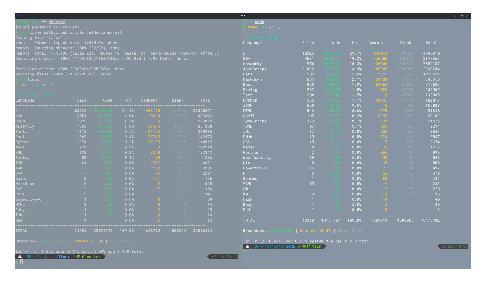

# mini-loc

`mini-loc` is an ultra-fast, minimal tool designed to index codebases. It is built for raw performance in C, making it an ideal choice for quickly scanning large project directories to count lines of code, comments, and blank lines.

## Performance
Built with speed in mind, `mini-loc` handles massive codebases in sub-second times.

| Target | Indexing Time |
| :--- | :--- |
| **Linux Kernel** | ~1.1 seconds |
| **Node.js** | ~0.25 seconds |



## Building
This project uses a `Makefile` for building and managing the project. Ensure you have `gcc`, `make`, `clang-format`, and `clang-tidy` installed.

### Build the project
To compile the source code, run:
```bash
make
```
The resulting binary will be located in the `bin/` directory.

### Cleaning
To remove all build artifacts and the binary, run:
```bash
make clean
```

### Installation
You can install `mini-loc` to your `~/.local/bin` directory:
```bash
make install
```
To uninstall:
```bash
make uninstall
```

## Usage
Point the program at a directory to begin indexing:

```bash
./bin/loc -r /path/to/codebase
```

## License
This project is open-source and licensed under the [MIT License](LICENSE).
